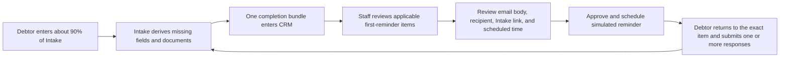
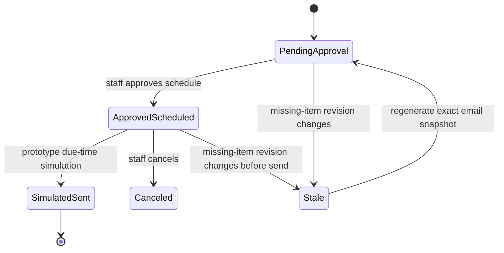

# BK FastLane CRM Lite - Intake Completion Review Workflow

## Purpose

Debtors usually submit an Intake that is mostly, but not entirely, complete. This workflow helps a bankruptcy attorney or paralegal answer two questions quickly:

1. What essential information and documents are still missing?
2. Is the consolidated reminder accurate, and when should its fake schedule be approved?

The workflow is matter-based. Staff review one incomplete debtor matter at a time rather than sorting through one queue row per document.

## Prototype boundary

The Jimmy branch uses deterministic fake clients and `@example.test` recipients. Email scheduling is simulated in browser storage; it does not contact Gmail, an email provider, a background scheduler, or a real debtor.

Production requires authenticated firm roles, tenant isolation, matter-scoped client access, private document storage, durable scheduling, delivery events, immutable audit records, and conflict-safe APIs. The Jimmy branch does not provide any of those controls and must never hold real client data.

## End-to-end flow



## Ownership

| Owner | Responsibilities |
| --- | --- |
| BK FastLane Intake | Canonical debtor data, document-request states, completion calculation, missing-item derivation, Intake return URL, and matter revision. |
| CRM | Staff-facing completion queue, schedule selection, approval record, exact email snapshot, communication/task entry, and workflow events. |
| Attorney/paralegal | Confirm the missing requests are appropriate and approve the schedule. |
| Email service (production only) | Deliver an approved immutable snapshot at its scheduled time and return delivery status. |

## Completion bundle

```ts
interface IntakeCompletionBundle {
  bundleVersion: 2
  matterId: string
  matterRevision: number
  ruleSetVersion: string
  items: CompletionItem[]
  reminderItems: CompletionItem[]
  metrics: CompletionMetrics
  states: {
    submission: 'draft' | 'submitted' | 'resubmitted'
    intakeCompletion: 'needs_client_action' | 'complete'
    documentReview: 'pending' | 'approved' | 'replacement_requested' | 'excused' | 'rejected'
    attorneyReview: 'not_started' | 'in_review' | 'complete'
  }
}

interface CompletionItem {
  id: string
  kind: 'field' | 'document' | 'review'
  label: string
  clientInstruction: string
  canonicalPath: string
  applicability: 'essential_now' | 'conditional' | 'contextual' | 'attorney_only' | 'deferred'
  applicabilityReason: string
  whyNeeded: string
  caseStageDeadline: string
  clientActionable: boolean
  priority: 'high' | 'medium' | 'low'
  resolutionStatus: 'open' | 'answered' | 'uploaded' | 'replaced' | 'unavailable' | 'not_applicable' | 'help_requested' | 'unsupported_file'
}
```

The Intake agent excludes legal review flags from the debtor email. A review flag may matter to the attorney without being a question the debtor should answer.

## Scheduled email record

The CRM creates this record only after approval:

```ts
interface ScheduledCompletionEmail {
  id: string
  matterRevision: number
  missingItemIds: string[]
  recipient: string
  subject: string
  bodySnapshot: string
  intakeResumeUrl: string
  scheduledFor: string
  timezone: 'America/Denver'
  status:
    | 'pending_approval'
    | 'approved_scheduled'
    | 'simulated_sent'
    | 'canceled'
    | 'stale'
    | 'failed'
  deliveryMode: 'simulation' | 'production'
  approvedBy?: string
  approvedAt?: string
  canceledBy?: string
  canceledAt?: string
}
```

## State transitions



Approval must be idempotent. Repeating approval against the same revision and schedule must not create duplicate communications or tasks.

## UI contract

The **Intake Completion** tab defaults to **Needs approval** and displays one row per incomplete matter:

- debtor name and chapter;
- overall completion percentage;
- number of missing essential fields;
- number of missing documents;
- reminder state.

Opening a row shows:

- a short list of missing essential information;
- a short list of missing documents;
- exact recipient and subject;
- complete email body containing every displayed missing item;
- Intake return link;
- scheduled date/time;
- **Approve & schedule reminder**.

After approval, the UI shows the schedule, approver, immutable body snapshot, and a cancel action. The CRM also creates one scheduled communication, one scheduled-reminder task, one timeline entry, and one completion event.

The fake pilot also creates two idempotent, browser-local cadence tasks under the same workflow key: suggest reminder 2 after five business days (within the 3-5 day policy window), and firm follow-up after ten days (within the 7-10 day window). Completion, any client response, reviewer cancellation/pause, an unavailable-item response, or the two-reminder maximum stops the cadence. Atomic cancellation closes the reminder communication, schedule, and all three related tasks together; nothing is delivered externally.

## Merge and concurrency rules

Intake refreshes may update canonical completion data. They must not overwrite CRM-owned approval state when the missing-item signature is unchanged.

In the Jimmy prototype, the full approved snapshot is hashed: recipient, subject, body, exact resume URL, sorted item instructions, and Matter revision. A changed hash preserves the approval in history, marks the draft stale, and requires reapproval. Any debtor response atomically cancels the pending simulated reminder, communication, task, and schedule before staff reviews the remaining items.

Production must additionally preserve the prior approval as immutable audit history and, when missing items change without full completion:

1. keep the prior approval event for audit history;
2. mark an unsent schedule `stale`;
3. regenerate the email body from the new missing-item list;
4. require a new staff approval.

Production mutations should include an expected revision or ETag and return `409 Conflict` when stale.

## Fake-debtor parity contract

The deterministic parity run must prove:

1. exactly 10 unique fake matters and package IDs;
2. all recipients end in `@example.test`;
3. the cohort covers Chapter 7/13, self-employment, unemployment, nonfiling spouse, vehicle surrender, recent transfer, tax unavailability, unreadable replacement, and mobile/accessibility cases;
4. each matter has a bounded, fact-specific set of applicable missing items;
5. source document states remain received or needed as generated;
6. every missing field/document appears in the completion bundle and email body;
7. every Jimmy-branch Intake link opens `intake-demo.html` with the matching `packageId` selected;
8. CRM import produces 10 matter-level completion rows;
9. approving a schedule records actor, time, schedule, exact body, task, communication, and timeline event;
10. reload and feed re-import preserve the approval and schedule;
11. the Jimmy branch makes no external send request.
12. partial and final fake responses cancel the simulated schedule without changing the independent Document Review or Attorney Review decision state;
13. desktop and mobile browser tests prove exact-item focus, file feedback, partial resubmission, reload/two-tab persistence, and page-level overflow safety;
14. a second generation produces the same package, completion-item, and document IDs.

Run the full contract with:

```powershell
node scripts/run-10-client-completion-review-parity.mjs
```

## Production follow-ons

- Replace the Jimmy `packageId` selector with authenticated, expiring resume tokens on `intake.bkfastlane.com`.
- Separate delivery execution from approval and use a durable job queue.
- Add role-based permission checks for attorney, paralegal, and client.
- Store immutable audit events and exact outbound message snapshots.
- Add stale-revision handling when a debtor edits Intake after approval.
- Add delivery, bounce, retry, cancellation, and opt-out rules.
