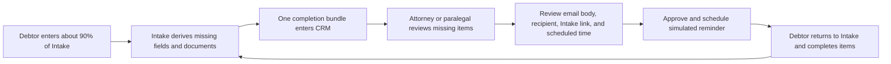
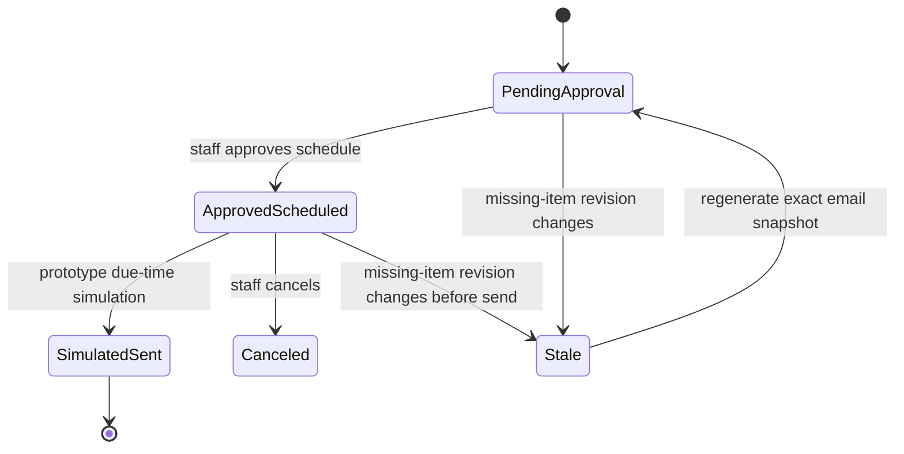

# BK FastLane CRM Lite - Intake Completion Review Workflow

## Purpose

Debtors usually submit an Intake that is mostly, but not entirely, complete. This workflow helps a bankruptcy attorney or paralegal answer two questions quickly:

1. What essential information and documents are still missing?
2. Is the consolidated reminder email accurate, and when should it be scheduled?

The workflow is matter-based. Staff review one incomplete debtor matter at a time rather than sorting through one queue row per document.

## Prototype boundary

The Jimmy branch uses deterministic fake clients and `@example.test` recipients. Email scheduling is simulated in browser storage; it does not contact Gmail, an email provider, a background scheduler, or a real debtor.

Production requires authenticated firm roles, matter-scoped client access, durable scheduling, delivery events, immutable audit records, and conflict-safe APIs.

## End-to-end flow



## Ownership

| Owner | Responsibilities |
| --- | --- |
| BK FastLane Intake | Canonical debtor data, document-request states, completion calculation, missing-item derivation, Intake return URL, and matter revision. |
| CRM | Staff-facing completion queue, schedule selection, approval record, exact email snapshot, communication/task entry, and workflow events. |
| Attorney/paralegal | Confirm the missing requests are appropriate and approve the schedule. |
| Email service (production only) | Deliver an approved immutable snapshot at its scheduled time and return delivery status. |

## Completion bundle

```ts
interface IntakeCompletionBundle {
  revision: number
  status: 'needs_client_action' | 'complete'
  percent: number

  fieldCompletion: {
    applicableRequired: number
    enteredRequired: number
    percent: number
  }

  documentCompletion: {
    applicableRequired: number
    receivedRequired: number
  }

  missingItems: CompletionItem[]
  intakeResumeUrl: string
  emailDraft: CompletionEmailDraft
  events: CompletionEvent[]
}

interface CompletionItem {
  id: string
  kind: 'field' | 'document'
  label: string
  clientInstruction: string
  canonicalPath: string
  essential: true
  priority: 'high' | 'medium' | 'low'
}

interface CompletionEmailDraft {
  recipient: string
  subject: string
  bodySnapshot: string
  intakeResumeUrl: string
  status: 'pending_approval'
  deliveryMode: 'simulation'
}
```

The Intake agent excludes legal review flags from the debtor email. A review flag may matter to the attorney without being a question the debtor should answer.

## Scheduled email record

The CRM creates this record only after approval:

```ts
interface ScheduledCompletionEmail {
  id: string
  matterRevision: number
  missingItemIds: string[]
  recipient: string
  subject: string
  bodySnapshot: string
  intakeResumeUrl: string
  scheduledFor: string
  timezone: 'America/Denver'
  status:
    | 'pending_approval'
    | 'approved_scheduled'
    | 'simulated_sent'
    | 'canceled'
    | 'stale'
    | 'failed'
  deliveryMode: 'simulation' | 'production'
  approvedBy?: string
  approvedAt?: string
  canceledBy?: string
  canceledAt?: string
}
```

## State transitions



Approval must be idempotent. Repeating approval against the same revision and schedule must not create duplicate communications or tasks.

## UI contract

The **Document Review** tab defaults to **Needs approval** and displays one row per incomplete matter:

- debtor name and chapter;
- overall completion percentage;
- number of missing essential fields;
- number of missing documents;
- reminder state.

Opening a row shows:

- a short list of missing essential information;
- a short list of missing documents;
- exact recipient and subject;
- complete email body containing every displayed missing item;
- Intake return link;
- scheduled date/time;
- **Approve & schedule reminder**.

After approval, the UI shows the schedule, approver, immutable body snapshot, and a cancel action. The CRM also creates one scheduled communication, one follow-up task, one timeline entry, and one completion event.

## Merge and concurrency rules

Intake refreshes may update canonical completion data. They must not overwrite CRM-owned approval state when the missing-item signature is unchanged.

In the Jimmy prototype, a changed missing-item signature regenerates a pending-approval draft. A completed Intake resubmission removes the matter from Completion Review, cancels any simulated scheduled reminder, and moves the lead to `Intake Submitted` for attorney review.

Production must additionally preserve the prior approval as immutable audit history and, when missing items change without full completion:

1. keep the prior approval event for audit history;
2. mark an unsent schedule `stale`;
3. regenerate the email body from the new missing-item list;
4. require a new staff approval.

Production mutations should include an expected revision or ETag and return `409 Conflict` when stale.

## Fake-debtor parity contract

The deterministic parity run must prove:

1. exactly 10 unique fake matters and package IDs;
2. all recipients end in `@example.test`;
3. each matter is 85-95% complete;
4. each matter omits at least one essential field and one document;
5. source document states remain received or needed as generated;
6. every missing field/document appears in the completion bundle and email body;
7. every Jimmy-branch Intake link opens `intake-demo.html` with the matching `packageId` selected;
8. CRM import produces 10 matter-level completion rows;
9. approving a schedule records actor, time, schedule, exact body, task, communication, and timeline event;
10. reload and feed re-import preserve the approval and schedule;
11. the Jimmy branch makes no external send request.
12. completing the fake Intake cancels a simulated schedule and moves the matter out of the completion queue into attorney review.

Run the full contract with:

```powershell
node scripts/run-10-client-completion-review-parity.mjs
```

## Production follow-ons

- Replace the Jimmy `packageId` selector with authenticated, expiring resume tokens on `intake.bkfastlane.com`.
- Separate delivery execution from approval and use a durable job queue.
- Add role-based permission checks for attorney, paralegal, and client.
- Store immutable audit events and exact outbound message snapshots.
- Add stale-revision handling when a debtor edits Intake after approval.
- Add delivery, bounce, retry, cancellation, and opt-out rules.
