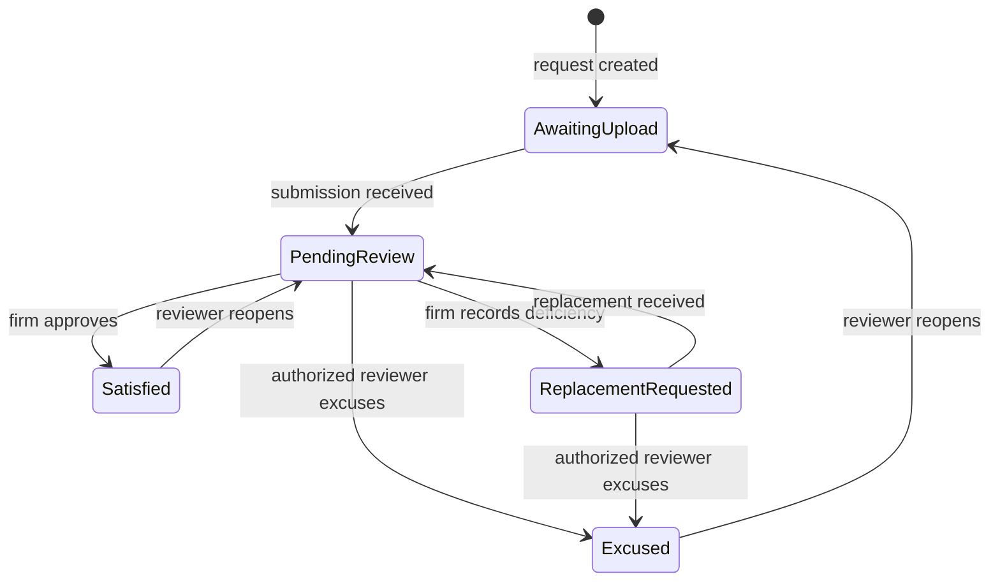

# BK FastLane CRM Lite - Document Review Workflow

Status: branch prototype specification  
Audience: product, design, frontend, backend, QA, and bankruptcy-workflow reviewers  
Scope: law-firm review of client document submissions after intake

## 1. Outcome

The workflow gives law-firm staff and attorneys one queue for deciding whether each requested document is usable, needs replacement, or is excused for the matter. Client uploads never become final merely because a file was received or passed automated analysis.

The prototype remains fake/demo-data-only. The production version requires authenticated firm roles, matter authorization, private file storage, immutable audit history, retention rules, and conflict-safe APIs.

## 2. Actors and authority

| Actor | Allowed actions |
| --- | --- |
| Client | Upload an initial submission, see client-safe deficiency instructions, upload a replacement, see whether the firm is still reviewing. |
| Firm staff | Triage received files, preview/download, approve administratively sufficient files when firm policy permits, request replacements, draft/send approved follow-up, and assign review work. |
| Attorney | Perform every staff action plus excuse a requirement, override a recommendation, and make legal/workflow decisions reserved by firm policy. |
| Automated analysis | Classify, extract, and recommend. It never approves, rejects, excuses, or makes a filing-readiness decision. |

Matt must approve which document types and outcomes are staff-authorized versus attorney-only.

## 3. Separate domain objects

Do not represent the entire lifecycle with one mutable `status` field.

### DocumentRequest

One requirement for one matter.

```ts
type DocumentRequestStatus =
  | 'awaiting_upload'
  | 'pending_review'
  | 'replacement_requested'
  | 'satisfied'
  | 'excused'

interface DocumentRequest {
  id: string
  firmId: string
  matterId: string
  documentType: string
  status: DocumentRequestStatus
  requiredByPolicy: boolean
  assignedReviewerId?: string
  dueAt?: string
  activeSubmissionId?: string
  revision: number
}
```

### DocumentSubmission

One immutable uploaded version. A replacement creates a new submission; it does not overwrite the rejected file.

```ts
type DocumentSubmissionStatus =
  | 'received'
  | 'under_review'
  | 'approved'
  | 'rejected'
  | 'superseded'

interface DocumentSubmission {
  id: string
  requestId: string
  version: number
  storageObjectId: string
  fileName: string
  receivedAt: string
  status: DocumentSubmissionStatus
  supersedesSubmissionId?: string
}
```

### DocumentDecision

An immutable adjudication event.

```ts
type DocumentDecisionAction =
  | 'approve'
  | 'request_replacement'
  | 'excuse'
  | 'reopen'

interface DocumentDecision {
  id: string
  requestId: string
  submissionId?: string
  actorId: string
  actorRole: 'staff' | 'attorney'
  action: DocumentDecisionAction
  reasonCode?: string
  internalNote?: string
  clientInstruction?: string
  createdAt: string
  requestRevision: number
}
```

### DocumentCommunication

The exact approved follow-up that was sent.

```ts
interface DocumentCommunication {
  id: string
  requestId: string
  channel: 'email' | 'sms' | 'portal'
  recipient: string
  subject?: string
  bodySnapshot: string
  status: 'draft' | 'approved' | 'sent' | 'failed'
  approvedBy?: string
  sentAt?: string
  dueAt?: string
}
```

## 4. State machine



Every transition records actor, timestamp, reason where required, and the expected request revision.

## 5. Law-firm UI flow

1. Open **Document Review** from the global CRM navigation.
2. Use queue filters: Awaiting review, Replacement needed, Resubmitted, Approved, Excused, or All.
3. Select a request and inspect the active submission, automated-analysis note, requirement policy, and version history.
4. Choose one disposition:
   - **Approve**: marks the active submission approved and the request satisfied.
   - **Request replacement**: requires a client-safe reason, rejects the active version, opens client follow-up, and leaves the request incomplete.
   - **Excuse**: requires a reason and authorized reviewer; no upload is required for request completion.
5. Approve and send the follow-up. Persist its exact content and next-due date.
6. When the client resubmits, add a new immutable version, mark the prior active version superseded, and return the request to pending review.
7. Approve or reject the replacement. The complete history remains visible.

## 6. Readiness rules

Keep these gates separate:

- **Collection progress**: required request has a received submission or an approved excuse.
- **Review progress**: required request is satisfied or excused.
- **Attorney package available**: the firm may open an attorney-review package even while collection is incomplete; missing and disputed items remain prominently flagged.
- **Document-review complete**: every applicable required request is satisfied or excused.
- **Filing readiness**: never inferred solely from this workflow. It remains an attorney-controlled downstream decision.

## 7. Replacement reason codes

Use structured internal codes plus editable client-safe instructions:

- `wrong_document`
- `wrong_person`
- `wrong_date_range`
- `missing_pages`
- `illegible`
- `password_protected`
- `stale_document`
- `duplicate`
- `suspected_alteration`
- `other`

The prototype requires text before a replacement request. Production should store both the code and the exact message sent to the client.

## 8. API boundary for production

Suggested routes:

```text
GET    /api/firms/:firmId/document-review-queue
GET    /api/matters/:matterId/document-requests
POST   /api/document-requests/:requestId/submissions
GET    /api/document-submissions/:submissionId/download
POST   /api/document-requests/:requestId/decisions
POST   /api/document-requests/:requestId/communications
```

Mutation requests must include an expected revision or ETag. Return `409 Conflict` for stale decisions so an attorney approval cannot silently overwrite a newer client resubmission.

## 9. Audit events

At minimum, record:

- request created or reopened;
- submission received;
- automated analysis completed;
- review assigned;
- approved;
- replacement requested with reason;
- follow-up approved/sent/failed;
- replacement received;
- prior version superseded;
- excused with reason;
- conflict rejected by the API.

Uploaded versions and decisions should not be deleted through normal UI actions. Retention and legal-hold behavior require firm-policy approval.

## 10. Prototype mapping

The branch prototype stores data in `localStorage` and extends existing `lead.docChecklist[]` rows with optional fields:

- `reviewStatus`
- `versions[]`
- `reviewEvents[]`
- `replacementReason`
- `excuseReason`
- `followUpSentAt`

Legacy values are normalized for display:

| Existing value | Review queue state |
| --- | --- |
| `ai_accepted`, `ai_flagged` | Pending review |
| `approved` | Approved |
| `open` plus rejected/replacement metadata | Replacement needed |
| `reason_given` with a non-chase reason | Excused / attorney review |
| other `open` values | Awaiting upload |

This compatibility layer is for the demo only; production should use the separate objects above.

## 11. Acceptance scenarios

1. Initial upload appears in Awaiting review and does not count as approved.
2. Approve records reviewer/time and moves the request to Approved.
3. Request replacement cannot complete without a reason.
4. Sending follow-up records the communication and its next-due date.
5. Resubmission creates version 2, preserves version 1, and returns to review.
6. Approving version 2 closes the request without deleting version 1.
7. Excuse requires a reason and is reversible.
8. A stale revision returns a conflict rather than overwriting newer state.
9. A client cannot access firm review controls.
10. Attorney-package access remains separate from document-review completion.

## 12. Open decisions for Matt

- Which outcomes may staff select, and which require an attorney?
- Does approval mean correct/readable, complete date coverage, corroborated intake data, or all three?
- Which document requests are always required versus conditional by debtor facts and chapter?
- Which excuse reasons are allowed and must any expire or require second review?
- Which deficiency details may be shown to the client versus kept internal?
- What follow-up cadence, channel, escalation, and stop rules should the firm use?
- How long should rejected and superseded versions remain available?

